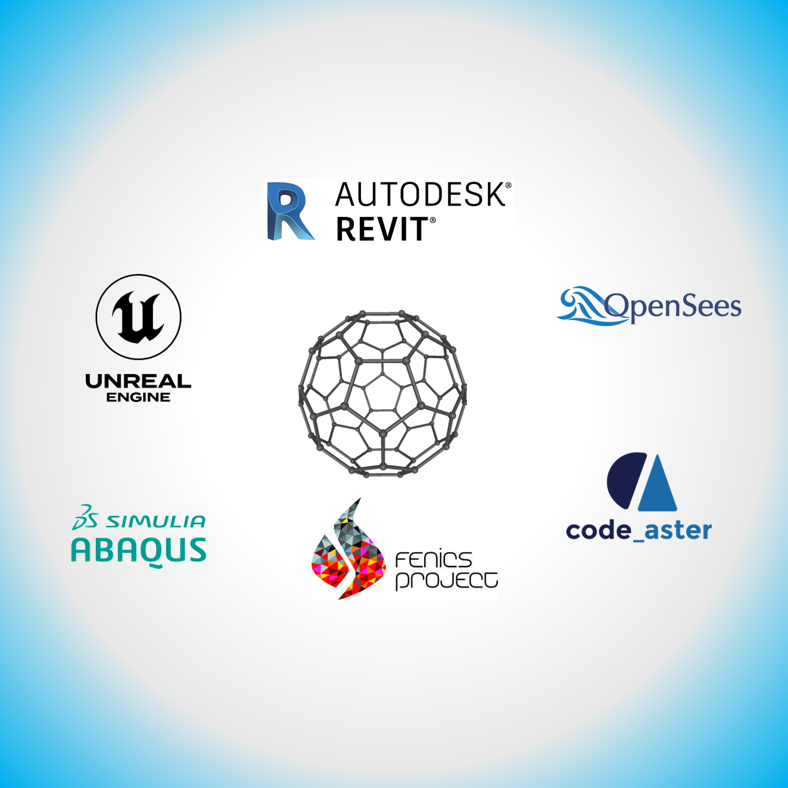

# BuckyBall

    

Wrapper for Structural Analysis Software - BIM Integration - Visualisation

**BuckyBall** can be seen as a _unified abstraction layer_ with software-specific **adapters**.
It can be used for:
- Script Generator for external/third party software for construction/structural analysis
- Multi-backend Interface

